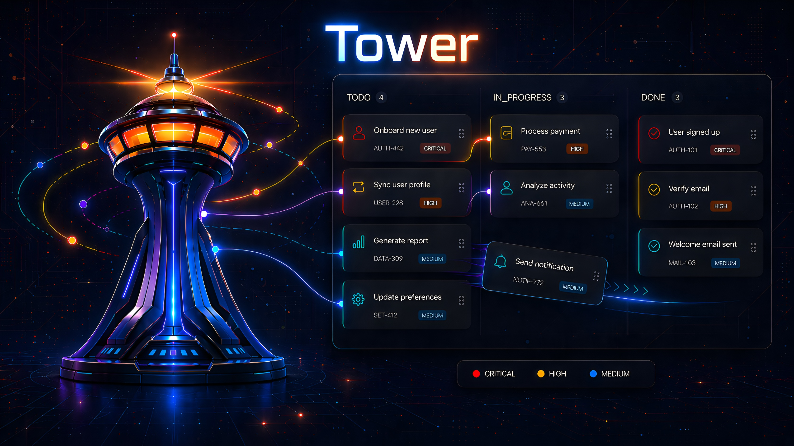

<p align="center">
  
</p>

<p align="center">
  AI 任务调度平台
</p>
<p align="center">
  <a href="./README.md">English</a> | <b>中文</b>
</p>

AI 任务调度平台 — 通过可视化看板管理、调度、执行 AI 辅助开发任务。

集成终端、代码编辑器、文件树、实时预览和 MCP 工具链，为个人开发者打造一站式 AI 开发办公流程助手。

## 快速开始

### 环境要求

- Node.js >= 22
- pnpm（推荐）

### 安装

```bash
git clone <repo-url>
cd tower
pnpm install

# 配置环境变量
cp .env.example .env
# 默认使用 SQLite，无需额外配置

# 初始化数据库
pnpm db:push
pnpm db:seed
pnpm db:init-fts

# 启动开发服务器
pnpm dev
```

浏览器打开 http://localhost:3000

### 生产构建

```bash
pnpm build
pnpm start
```

## 核心概念

```
Workspace（工作空间）
  ├── Project（项目）
  │     └── Task（任务）
  │           ├── Label（标签）
  │           ├── Execution（执行记录）
  │           └── Message（消息历史）
  └── Label（共享标签）
```

- **Workspace** — 顶层容器，管理多个项目和共享标签
- **Project** — 项目，可关联 Git 仓库和本地路径，类型分为 NORMAL 和 GIT
- **Task** — 任务卡片，在看板上按状态分列展示

## 功能特性

### 看板管理

- 拖拽任务卡片在列间移动（TODO → IN_PROGRESS → IN_REVIEW → DONE）
- 右键菜单：更改状态、启动执行、查看详情
- 搜索框模糊搜索任务标题和描述
- 任务优先级：LOW / MEDIUM / HIGH / CRITICAL
- 自定义标签（颜色 + 名称）

### 任务工作台

进入任务详情页，左侧为终端面板，右侧为三标签工作区：

#### 终端（Terminal）

- 基于 xterm.js + node-pty 的浏览器终端
- 完整 ANSI 渲染（颜色、进度条、光标移动）
- 点击"执行"启动 Claude CLI，实时输出
- 支持键盘输入，与 Claude 交互式对话
- 窗口大小自动同步
- 断开重连不丢失会话

#### 文件浏览器（Files）

- 树形目录浏览 worktree 文件结构
- gitignore 自动过滤
- 文件 git 状态标记（M/A/D）
- 右键菜单：新建文件/文件夹、重命名、删除
- 执行中自动刷新文件树

#### 代码编辑器

- Monaco Editor（VS Code 同款引擎）
- 语法高亮：TypeScript、JavaScript、Python、JSON、YAML、CSS、HTML、Markdown、Prisma
- 多标签编辑，Ctrl+S 保存
- 未保存文件标记（dirty dot）
- 主题跟随深色/浅色模式

#### 变更（Changes）

- 查看当前任务分支与基础分支的 diff
- 合并确认流程

#### 预览（Preview）

- 启动前端开发服务器（如 `npm run dev`）
- iframe 内嵌预览
- 自动推算预览地址（根据命令识别端口）
- 保存文件后自动刷新预览
- 离开页面自动停止开发服务器

### 任务执行生命周期

```
创建任务 → 点击执行 → TODO 自动变为 IN_PROGRESS
    → Claude CLI 在终端运行 → 执行完成（exit 0）→ IN_REVIEW
    → 人工检查 → 合格则 DONE / 不合格可重新执行
```

- 启动执行时自动创建 Git worktree（如配置了 baseBranch）
- 执行完成后触发飞书通知（需配置）
- 失败时任务保持 IN_PROGRESS，可重试

### 项目管理

- 创建项目时选择本地文件夹，自动检测 Git 仓库并填充 gitUrl
- 项目类型：FRONTEND / BACKEND（影响预览功能可用性）
- Git Path Mapping 规则：按 host + owner 自动推算本地路径

### 设置

| 分类 | 配置项 |
|------|--------|
| 通用 | 主题（深色/浅色/系统）、语言（中/英）、默认终端 App |
| 终端 | WebSocket 端口、空闲超时时间 |
| 系统 | 上传限制、并发数、Git 超时、搜索参数 |
| CLI Profile | CLI 命令、参数、环境变量 |
| Prompts | 自定义 Agent 提示词模板 |
| Agent | Agent 配置管理 |
| Git 规则 | 路径映射规则（host/owner → 本地路径） |

### 国际化

支持中文和英文，在设置页切换。

## MCP 集成

Tower 提供 MCP Server，可被外部 AI Agent 调用：

```json
{
  "mcpServers": {
    "tower": {
      "command": "npx",
      "args": ["tsx", "<project-root>/src/mcp/index.ts"]
    }
  }
}
```

### 可用工具（24 个）

| 分类 | 工具 |
|------|------|
| Workspace | list_workspaces, create_workspace, update_workspace, delete_workspace |
| Project | list_projects, create_project, update_project, delete_project |
| Task | list_tasks, create_task, update_task, delete_task, move_task |
| Label | list_labels, create_label, delete_label, set_task_labels |
| Search | search（全局搜索任务/项目/仓库） |
| Terminal | get_task_terminal_output, send_task_terminal_input, get_task_execution_status |
| Knowledge | identify_project |
| Notes/Assets | manage_notes, manage_assets |

## 开发命令

```bash
pnpm dev            # 启动开发服务器（Webpack 模式，node-pty 需要）
pnpm build          # 生产构建
pnpm test           # 运行测试（watch 模式）
pnpm test:run       # 运行测试（单次）
pnpm db:push        # 同步 Prisma schema 到数据库
pnpm db:seed        # 填充种子数据
pnpm db:studio      # 打开 Prisma Studio（数据库可视化）
pnpm db:init-fts    # 初始化全文搜索索引
pnpm mcp            # 启动 MCP Server（独立进程）
```

## 技术栈

- **框架**: Next.js 16 (App Router)
- **语言**: TypeScript
- **数据库**: SQLite (Prisma ORM)
- **终端**: node-pty + xterm.js + WebSocket
- **编辑器**: Monaco Editor
- **样式**: TailwindCSS 4
- **拖拽**: dnd-kit
- **测试**: Vitest

## 环境变量

| 变量 | 说明 | 默认值 |
|------|------|--------|
| DATABASE_URL | 数据库连接串 | `file:./prisma/dev.db` (SQLite) |
| PORT | 服务端口 | 3000 |
