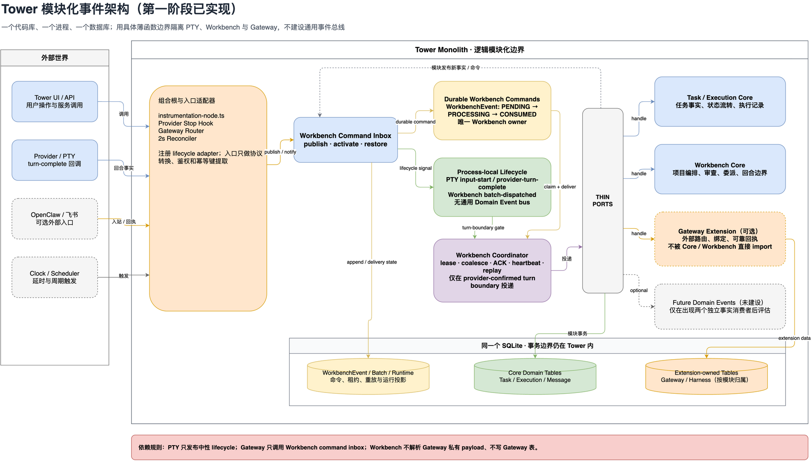
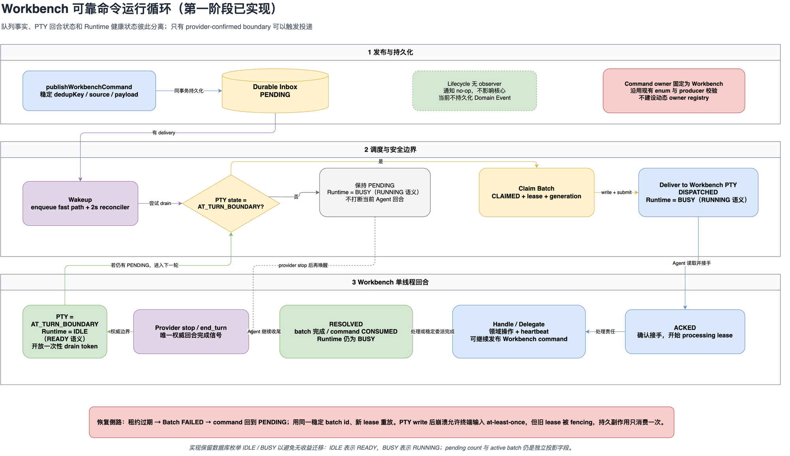

# Tower 模块化事件架构目标

> 状态：第一阶段已实现，后续 Domain Event 内核仍为候选
> 日期：2026-07-31

这份目标不拆 npm 包、不拆服务、不拆数据库。它只在 Tower 单体内部建立稳定的模块边界，
让 Workbench、Task Core 和 Gateway Extension 可以独立演进。

## 架构图

- 可编辑源文件：[`../diagrams/tower-modular-event-architecture-target.drawio`](../diagrams/tower-modular-event-architecture-target.drawio)
- Page 1：模块边界与依赖方向
- Page 2：Workbench 事件运行循环





## 第一阶段实施结果

本轮采用评审后的收敛方案，没有实现通用 Event Bus、动态订阅、DLQ 或新的持久化表。
落地的是三组具体薄边界，以及一个独立的 Runtime 正确性修复：

| 边界 | 代码位置 | 当前职责 |
|---|---|---|
| PTY lifecycle | `src/lib/pty/lifecycle.ts` + `src/lib/workbench/pty-lifecycle-adapter.ts` | PTY 只发布 semantic input-start / provider-turn-complete；Workbench adapter 关闭或开放 disposable drain token，并更新 Runtime 投影 |
| Workbench command inbox | `src/lib/workbench/command-inbox.ts` | Gateway 与派生任务只通过公开发布/激活函数提交可靠命令，不 import coordinator |
| Workbench delivery lifecycle | `src/lib/workbench/delivery-lifecycle.ts` + `src/lib/harness/workbench-delivery-adapter.ts` | coordinator 只报告 batch dispatched；Gateway adapter 自己解析 source reference 并更新 GatewayInbound |
| Composition root | `src/instrumentation-node.ts` | 进程启动时注册上述两个 adapter，业务模块不互相做隐式初始化 |

Gateway adapter 在启动时还会把未完成的旧版 `gatewayMessage / gatewayInboundId` payload 原地升级为
通用 `instruction / sourceReference` envelope；历史 PENDING/PROCESSING 工作不会因边界升级丢失正文。

PTY 输入也已拆成传输与回合语义两条路径：`writeRaw` 只透传字节，不改变 turn state 或
`lastInputAt`；`writeSubmittedInput` 才发布 input-start lifecycle、更新 `lastInputAt` 并进入
`BUSY`。浏览器协议把独立 CR 标成 `submit`，其余输入与协议回复保持 raw。

Runtime 仍保留数据库枚举 `IDLE / BUSY`，避免只为改名产生迁移。当前语义明确为：

- `BUSY`：provider 回合仍在执行，或存在 active batch；`resolveWorkbenchBatch` 不再宣称回合完成。
- `IDLE`：live PTY 已收到 provider-confirmed stop/end_turn，可安全尝试下一次 drain。
- `pendingEvents` 与 `activeBatchId` 是独立投影字段，不再用队列深度推导 provider 回合状态。
- `lastTurnCompletedAt` 只由 provider-turn-complete lifecycle 更新。
- `Batch=RESOLVED / Event=CONSUMED` 后 Provider 回合仍可能 `BUSY`；Stop 后才进入
  `IDLE`、开放一次性 drain token 并尝试下一条 `PENDING`。

可靠协议保持不变：

```text
WorkbenchEvent: PENDING -> PROCESSING -> CONSUMED
WorkbenchBatch:            CLAIMED -> DISPATCHED -> ACKED -> RESOLVED / FAILED
```

`PTY submit -> DISPATCHED` 之间仍是明确的 at-least-once 窗口。若进程在提交终端输入后崩溃，恢复会用同一稳定
batch ID 和新 lease 重放，旧 lease 被 fencing；终端输入可能重复，但 TaskMessage、WorkbenchEvent 等
持久副作用不会重复消费。测试按这条真实契约验收，不承诺 exactly-once terminal injection。

当前没有持久化逐轮 `turnId` / `turnSeq`。live turn state、Provider transcript、durable
Event/Batch 和 Runtime 投影仍是分层机制，不能合并解释。

模块边界测试会阻止三类回归：PTY 重新 import Workbench、Gateway 重新 import coordinator、Workbench
coordinator 重新写 Gateway-owned 表。

## 现状痛点（改动动机）

这份目标不是从零搭建。Runtime / Batch / Event 三张表和各自的状态枚举已经存在，
租约、heartbeat、ACK、RESOLVE、回合边界门控也都在跑。真正驱动这次调整的是三个具体问题：

1. **回合结束这个关键事实是易失的内存态。**
   `deriveWorkbenchRuntimeState`（`src/lib/workbench/coordinator.ts:135-143`）里的 `IDLE`
   只表示“有 live session、无积压、无 active batch”，它**不等于**“provider 回合结束、可以投递下一批”。
   “可投递”这个事实实际存在 `src/lib/workbench/boundary.ts` 的 `globalThis.__workbenchDrainBoundary`
   内存 `Set` 里，判定投递时得另外调 `hasWorkbenchDrainBoundary`。该 Set 跨 stop hook route、
   `pty-session.ts`、`gateway-router.ts`、`coordinator.ts` 四处消费，**进程重启即丢**，
   还需要 `restoreWorkbenchDrainBoundary`（`coordinator.ts:942`）在恢复路径上补救。
   ~~这是 PTY 回合状态需要提升为一等持久状态的直接原因。~~
   **（二轮修正）** 该 Set 自带恢复机制——注释即自称 `disposable drain token`（`coordinator.ts:938`），
   重启由 `restoreWorkbenchBoundaryFromProviderTranscript` 依据 provider transcript 的
   `stop_reason=end_turn` 重建（`coordinator.ts:977-1004`），并有 `reconcilePendingWorkbenchEvents`
   兜底（`coordinator.ts:1037`）。故“重启即丢”**不等于**权威事实丢失，持久化边界改列为非优先项，
   详见下方 Codex 复核第 1 节。

2. ~~**`IDLE` 语义被复用。**~~ **（二轮修正：此条不成立）** 经核验，派发路径读的是 live
   `session.isAtTurnBoundary`（`coordinator.ts:265` / `:944`），并**不读** `Runtime.state`；
   `WorkbenchRuntime` 是 operational projection，不参与调度判定。因此不存在“两处必须对齐才正确”的
   调度问题。Runtime 真正的偏差是另一个投影 bug，见 Codex 复核第 2 节。

3. **Command / Domain Event 二分目前是纸面的。** 四个 `WorkbenchEventKind`
   （`CHILD_REVIEW_REQUIRED` / `CHILD_DECISION_REQUIRED` / `CHILD_EXECUTION_FAILED` / `GATEWAY_WORK_REQUEST`）
   本质都是 Command，系统里还没有一个真正的 `0..N` 消费者的 Domain Event。

## 目标边界

1. `Task / Execution Core` 只管理任务与执行事实。
2. `Workbench Core` 只管理项目编排、审查、委派和 provider 回合边界。
3. `Gateway Extension` 管理外部消息路由、上下文绑定和可靠回执；Core 与 Workbench 不直接依赖它。
4. 模块协作只经过稳定的 Event Port 和领域端口，不直接写其他模块拥有的数据表。
5. 仍使用同一个进程和 SQLite；数据库按表归属形成逻辑边界，而不是物理拆分。

## 事件内核的最小职责

事件内核只负责：统一 envelope、持久化、订阅映射、调度策略、租约、ACK、重试和重放。
它不负责业务决策，也不成为新的工作流 DSL。

消息必须区分两类：

| 类型 | 语义 | 消费者 | 无消费者时 |
|---|---|---|---|
| Command | 请求某个模块执行动作 | 必须有唯一 owner | 拒绝或进入 `BLOCKED / DLQ` |
| Domain Event | 陈述已经发生的事实 | `0..N` subscribers | 不生成 delivery，核心继续运行 |

定时任务不是第三种消息。Scheduler 只负责在到期时发布 Command 或 Domain Event。

## Workbench 目标循环

1. Command 或 Event 先持久化，之后才允许调度。
2. Workbench 正在执行 provider 回合时，新 delivery 保持 `PENDING`，不能插入当前回合。
3. 只有 provider 的 `stop / end_turn` 证据能把 PTY 置为 `AT_TURN_BOUNDARY`。
4. Dispatcher 在该边界领取批次并投递；写入 PTY 后 Runtime 立即进入 `RUNNING`。
5. Workbench `ACK` 后获得处理租约，处理期间 heartbeat，完成后 `RESOLVE`。
6. `RESOLVE` 只结束 delivery 责任，不表示 provider 回合已经结束；Runtime 仍保持 `RUNNING`。
7. provider 再次确认回合结束后，Runtime 才进入 `READY` 并允许下一批投递。
8. 任一租约过期时，稳定 delivery ID 回到 `PENDING` 并重放。

## 状态语义调整

不再用一个模糊的 `IDLE` 同时表示“没有积压”“Agent 没输出”“可以投递”。目标状态至少要区分：

- PTY：`AT_TURN_BOUNDARY | TURN_RUNNING | STOPPED`
- Runtime：`STARTING | READY | RUNNING | BLOCKED | DEGRADED | STOPPED`
- Delivery / Batch：独立保存 `PENDING / CLAIMED / DISPATCHED / ACKED / RESOLVED / FAILED`

队列长度、active batch 和 provider 回合状态是独立事实，不能互相推导替代。

## Delta 清单（相对现状，按 ROI 排序）

> **⚠️ 本表已被下方《Codex 复核》推翻/修正，保留作讨论记录。**
> 结论：#1（持久化边界）降为非优先、#3（Batch 加 PENDING）作废、#4（模块端口）升为核心交付。
> 最终以《修订后的实施顺序》+《二轮复核回应》为准。

前面的“目标”多数已在代码里。真正需要动的只有以下几条，其余保持不变：

| # | 改动 | 现状 → 目标 | ROI / 备注 |
|---|---|---|---|
| 1 | **持久化 PTY 回合边界** | 内存 `Set`（`boundary.ts`）→ 一等持久状态 `AT_TURN_BOUNDARY / TURN_RUNNING / STOPPED` | 高。唯一有崩溃恢复价值的一条，可消掉 `restoreWorkbenchDrainBoundary` 补救逻辑。**建议单独立项先做。** |
| 2 | **收敛 `IDLE` 语义** | `IDLE` 兼表“队列空”和“可投递” → 投递判定只读 #1 的持久回合状态 | 中。依赖 #1；本质是把两处对齐的判定收敛到一处。`IDLE→READY` / `BUSY→RUNNING` 只是随手改的重命名，无独立收益。 |
| 3 | **Delivery 增加 `PENDING`** | Batch 枚举 `CLAIMED/DISPATCHED/ACKED/RESOLVED/FAILED` → 增补 `PENDING` | 中。让“已持久化未领取”成为显式状态，配合 #1 的边界门控。 |
| 4 | **Event Port 薄边界** | 跨模块直接 import → 一层薄函数边界隔离 Task Core / Workbench / Gateway | 低（现在）。今天只有单生产者单消费者，**先不抽象成接口**（避免单实现接口），仅用薄函数挡住直接依赖；出现第二个真实消费者再评估抽 Port。 |
| 5 | **落地一个真实 Domain Event** | 无 → 至少一个 `0..N` 消费者事件 | 低。Command/Event 二分在有真实 Event 用例前不落地，否则是 YAGNI。 |

已经具备、无需改动：三张表与状态枚举的拆分、租约 / heartbeat / ACK / RESOLVE、
持久化先于调度、回合边界门控（逻辑已在，只是 #1 要把它的“事实”从内存搬到持久层）。

## Codex 复核：对上述 Delta 的修正

> 复核结论：关于“不要提前抽象通用 Domain Event”的判断成立；但“优先持久化
> boundary”“给 Batch 增加 PENDING”以及“Event Port 当前 ROI 低”三项不能直接采纳。

### 1. `boundary.ts` 的 Set 不是权威回合事实

当前实现实际存在三个不同层次：

| 层次 | 当前载体 | 语义 |
|---|---|---|
| live provider 回合状态 | `PtySession._turnState` / `isAtTurnBoundary` | 当前 PTY 是否收到 provider turn-complete，是 live session 内的强事实 |
| provider 持久证据 | Claude transcript 的 `stop_reason=end_turn`；Codex transcript 中不早于 `lastInputAt` 的 `task_complete` | stop hook 丢失时用于恢复 turn boundary 的证据 |
| 一次性调度许可 | `boundary.ts` 的内存 `Set` | 可丢失、可重建、消费一次即关闭的 drain token |

`restoreWorkbenchDrainBoundary` 上方的代码注释已经明确称该 Set 为
`disposable drain token`，并要求恢复前重新验证 live PTY 的 `isAtTurnBoundary`。
`restoreWorkbenchBoundaryFromProviderTranscript` 只在 transcript 给出有效完成证据时恢复 live
session 状态和 token。Claude 使用 `stop_reason=end_turn`；Codex 还用 `lastInputAt` 作时间栅栏，
拒绝早于最后一次语义提交的旧 `task_complete`。

因此，内存 Set 在进程重启后丢失本身不是“权威事实丢失”。完整进程重启时旧 PTY 同样不可恢复，
startup 会把旧 `RUNNING` execution 清理为 `FAILED`；有 `PENDING` 工作时 reconciler 会启动或继续
一个新的 Workbench，并在新的空输入边界打开 token。

把裸 `AT_TURN_BOUNDARY` 枚举直接持久化反而可能制造危险窗口：Tower 在写入 PTY 后、把数据库状态
改成 `TURN_RUNNING` 前崩溃，下一进程可能读取旧的 `AT_TURN_BOUNDARY` 并重复注入。如果未来确有
持久化需求，必须至少绑定 `executionId + generation + turn sequence/eventId`，且在 PTY 写入前完成
fencing；不能只把当前 Set 搬进数据库。

**处理意见：否决 Delta #1 作为第一优先级。** 先保留 live turn state、provider transcript 和
disposable token 的现有分工；只有故障注入测试证明存在无法恢复的真实缺口后，再设计持久 TurnRecord。

### 2. Runtime 语义问题已修复，且从来不是调度双事实问题

`WorkbenchRuntime` 的 schema 注释明确说明它是 operational projection，不是 inbox 的事实来源。
当前调度路径也不读取 `WorkbenchRuntime.state` 来决定是否注入，而是读取 live session 的
`isAtTurnBoundary` 并消费 drain token。因此 `Runtime.IDLE` 和 boundary Set 并不是两个必须保持一致
才能保证正确性的调度事实。

当前实现中，`resolveWorkbenchBatch` 结束 durable batch responsibility 后把 Runtime 投影为
`BUSY` 并清除 active batch；Agent 此时仍可在当前 provider 回合里执行收尾。Provider
completion lifecycle 才把 Runtime 投影为 `IDLE` 并开放 drain boundary。

**已落地的处理：** Runtime 投影遵守以下规则：

1. `resolveWorkbenchBatch` 只结束 batch responsibility，不写 `turnCompleted=true`。
2. provider stop hook 才更新 `lastTurnCompletedAt` 和可投递状态。
3. Runtime 是否 `READY/RUNNING` 从 live `isAtTurnBoundary` 投影；pending count、active batch 独立展示。
4. `IDLE→READY`、`BUSY→RUNNING` 是否立即迁移 enum，可根据迁移成本决定；调度不能依赖这些展示状态。

### 3. Batch 不应增加 `PENDING`

`WorkbenchEvent.state=PENDING` 已经完整表达“消息已持久化、尚未领取”。`WorkbenchBatch` 只在
coordinator 原子领取一组 Event 时创建，所以从 `CLAIMED` 开始是正确的生命周期：

```text
WorkbenchEvent: PENDING → PROCESSING → CONSUMED
WorkbenchBatch:            CLAIMED → DISPATCHED → ACKED → RESOLVED
```

给 Batch 增加 `PENDING` 会让同一个“未领取”事实同时存在于 Event 和 Batch 两处，还需要新增一致性、
去重和崩溃恢复规则，没有提供新的可靠性保证。本文图中的 `delivery PENDING` 指持久 inbox/delivery，
不是要求预先创建一个 `PENDING WorkbenchBatch`。

**处理意见：否决 Delta #3。** 保留现有 Event PENDING 和 Batch CLAIMED 起点。

### 4. 薄模块端口应是第一阶段核心，而不是低 ROI

当前已经存在三条具体的反向依赖：

1. `src/lib/pty/pty-session.ts` 直接 import Workbench boundary，并在任意 PTY write 时关闭它。
2. `src/lib/harness/gateway-router.ts` 直接 import Workbench coordinator 的 enqueue/open/restore。
3. `src/lib/workbench/coordinator.ts` 解析 Gateway payload，并直接更新 `GatewayInbound` 状态。

这意味着问题不是“是否已有第二个消费者”，而是底层 PTY、Workbench Core 与 Gateway Extension
已经互相知道实现细节。即使始终只有一个消费者，这种依赖方向也会阻碍模块独立演进和测试。

这里同意“不为单实现创建 interface 层级”，但薄端口可以只是命名清晰的函数和类型模块：

- PTY 暴露通用的 semantic input-start / provider-turn-complete 生命周期通知，不 import Workbench。
- Gateway 通过 Workbench command inbox 的发布函数提交工作，不直接操作 boundary。
- Workbench coordinator 不解析 Gateway 私有 payload，也不直接写 Gateway 表。
- Gateway 对 Workbench delivery lifecycle 的状态映射由 Gateway 自己拥有。

**处理意见：提高 Delta #4 优先级。** 这是本次“同一单体内模块拆分”的主要交付，不需要等待第二个
消费者；但第一阶段只建立具体薄函数边界，不建设通用插件系统或复杂接口体系。

### 5. 不为证明架构而创造 Domain Event

当前四种 `WorkbenchEventKind` 都被投递给唯一父 Workbench，并要求其 review、decision、recover 或
create work。从当前 delivery 语义看，它们属于 Workbench command inbox。`CHILD_EXECUTION_FAILED`
的命名描述了一个事实，但当前 prompt 仍要求 Workbench 采取动作，不能仅凭名称把它视为已经具备
`0..N` fan-out 语义的 Domain Event。

**处理意见：采纳 Delta #5 的 YAGNI 判断，但删除“至少落地一个真实 Domain Event”这个交付项。**
应该先出现两个真实且彼此独立的事实消费者，再把对应事实提升成 Domain Event；不能为了验证 Event
Port 而制造消费者。

## 修订后的实施顺序

| 阶段 | 改动 | 验收标准 |
|---|---|---|
| A | 建立 PTY lifecycle、Workbench command inbox、Gateway lifecycle 三组薄函数边界 | PTY 不 import Workbench；Gateway 与 Workbench coordinator 不再双向依赖；Workbench 不直接写 Gateway 表 |
| B | 修正 Runtime 投影语义（已完成） | Batch resolve 后 provider 回合仍显示运行中；只有 stop/end_turn 更新 turn-complete；调度行为不读取 Runtime 展示状态 |
| C | 收敛命名和模块目录 | Command inbox、Runtime、Gateway-owned data 的归属能从目录和类型名直接识别；不改变现有 Event/Batch 可靠协议 |
| D | 用故障注入验证边界恢复 | stop hook 丢失、模块 reload、Tower 进程重启、PTY 写入前后崩溃均不会忙时注入或重复消费 |
| E | 按真实需求引入 Domain Event | 只有出现至少两个独立事实消费者时才建立 `0..N` 订阅和 per-subscriber delivery |

### 明确保持不变

- `WorkbenchEvent.PENDING → PROCESSING → CONSUMED`。
- `WorkbenchBatch.CLAIMED → DISPATCHED → ACKED → RESOLVED / FAILED`。
- lease、generation、fencing token、heartbeat 和稳定 batch ID。
- provider-confirmed turn boundary，不使用终端输出静默作为安全条件。
- 一个代码库、一个进程、一个 SQLite，不引入外部 broker。

## 二轮复核回应（针对 Codex 复核）

Codex 复核的五条经逐条对代码核验全部成立，采纳其《修订后的实施顺序》A–E。上文《现状痛点》#1、#2
已标注修正，《Delta 清单》已标注推翻。此处仅补两点验证中发现、双方均未说透的问题：

### a. Runtime 投影修正（Codex 第 2 节）已独立落地

这一修正与端口重构无关，当前实现已独立完成：resolve 只结束 durable batch responsibility，
Provider completion lifecycle 才更新 `lastTurnCompletedAt`。调度仍直接校验 live PTY boundary，
不依赖 Runtime 展示状态。

### b. 阶段 D 必须验证一个**已存在**的 fencing 窗口，而非只防持久化边界引入的新窗口

Codex 用“写 PTY → 崩溃 → 下个进程重复注入”论证反对裸持久化 `AT_TURN_BOUNDARY`，成立。但同一类窗口在现有
`CLAIMED →（写 PTY）→ DISPATCHED` 之间可能**已经存在**：若写完 PTY、标 `DISPATCHED` 前崩溃，重启后 batch 仍为
`CLAIMED`、租约过期被重新领取 → 重复投递。

因此阶段 D 的验收不能默认“现状安全、只有持久化边界才危险”，其**第一个故障注入点**就应打这里：确认写 PTY 与
`state=DISPATCHED` 之间崩溃不会导致重复注入（需核实二者的持久化先后与 fencing）。本轮尚未追到该写入顺序的确切实现，
留给阶段 D 或实现前 spike 确认。

## 第一阶段不做

- 不引入 Kafka、Redis、NATS 或第二个数据库。
- 不实现动态插件市场或运行时加载任意 handler。
- 不把所有现有表立即迁移成一张通用 Event 表。
- 不把同步领域调用强行改成异步事件。
- 不把事件内核扩成通用工作流引擎。

第一阶段可以让 Event Port 适配现有 `WorkbenchEvent`、`WorkbenchBatch` 和 outbox，先解除模块依赖；
只有出现第二、第三个真实消费者后，再评估是否统一底层表结构。
