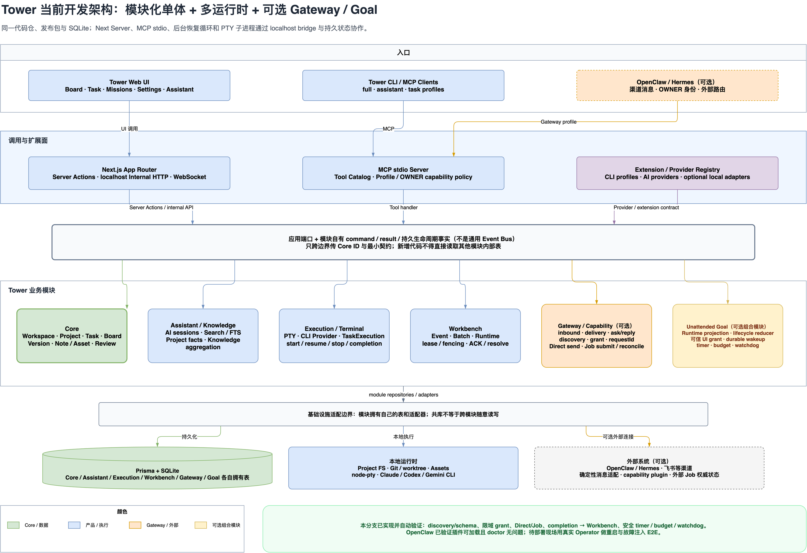

# 终极无人值守电脑架构图解

> 状态：实现候选版；已同步纵向闭环代码，本地 UI 持久化闭环与真实 Operator 故障注入待交叉验收
> 定稿日期：2026-08-02
> 上位章程：[`ultimate-unattended-computer-charter.md`](./ultimate-unattended-computer-charter.md)
> 可编辑图源：[`ultimate-unattended-computer.drawio`](./diagrams/ultimate-unattended-computer/ultimate-unattended-computer.drawio)
> 验收方案：[`ultimate-unattended-computer-acceptance.md`](./ultimate-unattended-computer-acceptance.md)

本文把章程中的系统边界转成四张图，回答四个不同问题：

1. 系统由谁负责什么，数据归谁；
2. Tower 调用外部能力时，Direct 与 Job 分别怎么走；
3. 终端、进程或回调中断后，Goal 与外部 Job 如何恢复。
4. 当前 Tower 从入口、调用面、业务模块到基础设施如何运行，以及哪些能力仍需部署现场验证。

图中的 `Capability Port`、`Durable Wakeup Inbox`、`结果与证据汇聚` 都是**逻辑职责**，不是已经决定
要新建的服务、进程或数据库。Technical Spec 必须优先把这些职责映射到 OpenClaw 和 Tower 的现有能力。

本文是本方案唯一图文索引。四张导出图共同来自同一个多页 `.drawio` 图源；后续修改覆盖原文件，不新增
评审轮次、候选稿或 `v1` / `v2` 副本。

## 1. 总体架构


### 1.1 从左向右阅读

第一列是两个入口：

- 人类通过飞书、微信等渠道进入 OpenClaw，由 o-tower 理解消息与会话；
- 开发者在电脑前可以直接进入 Tower，不需要绕行 OpenClaw。

第二列是两个中枢：

- **OpenClaw** 拥有 OWNER 身份、渠道、外部 Job、凭据和本机 Operator 路由；
- **Tower** 拥有 Workspace、Project、Task、Goal、项目产物和审查结果。

中间虚线区域是结构化能力契约边界。o-tower 和 Tower 都可以提交同一种 `CapabilityRequest`，但
请求不携带具体 Agent、workspace 路径或底层命令。边界负责 discovery/schema、授权、去重、车道选择、
结果归一化和恢复对账；这些职责可以由多个现有工具共同承担。

右侧执行层分为两类：

- **Transport / Adapter**：发送已经生成好的消息，或执行参数明确的结构化 API；
- **Operator**：处理确实需要理解、规划、观察和 GUI 操作的多步工作。

两类执行结果先汇聚成统一结果与证据，再回到原主责任方：项目结果回 Tower 推进和审查，渠道请求结果
回 OpenClaw 的正确会话。外部能力调用不会改变项目事实所有者。

### 1.2 三条硬边界

1. Tower 不保存 `computer.gui -> operator`、`feishu.* -> xiao-fei` 等本机路由和凭据。
2. OpenClaw 不复制 Tower 的项目、任务、Goal 和知识作为第二套业务真相。
3. Agent 不能通过填写布尔字段、调用 `set_goal_mode` 或改写目标来自我授权。

### 1.3 Tower 当前实现架构



Tower 当前是一个模块化单体发布，但不是严格的单进程：Next.js Server 与 MCP stdio server 是独立运行时，
任务终端是 PTY 子进程；它们共享同一代码库、发布包和 Prisma + SQLite，并由 localhost internal HTTP、
WebSocket 与持久状态协调。边界先落实为代码目录、模块自有运行态、MCP capability group、应用端口和
生命周期事实：

- **Core** 只拥有 Workspace、Project、Task、记录/笔记与审查等项目事实；
- **Execution / Terminal** 拥有 PTY、Provider 和执行记录，只报告执行生命周期；
- **Workbench** 拥有批次、lease、fencing、ACK 与 resolve，协调执行但不拥有 Goal 策略；
- **Gateway / Capability** 拥有外部消息、投递、ask/reply、版本化 discovery/schema、限域 grant、
  `requestId` 关联、Direct 消息和外部 Job 提交/只读对账；具体 Operator 路由仍归 OpenClaw；
- **Unattended Goal** 是依赖 Gateway 的可选组合模块；当前实现运行态投影、生命周期 reducer、可信 UI
  grant、Job completion 到 Workbench 的安全唤醒、持久 timer、预算和 watchdog。

同库不等于跨模块随意读表。新增代码应通过模块入口传 command/event/result，只把 Core ID 当引用。等到
独立部署、独立发布或数据保留策略带来明确收益时再拆包；届时不应修改 Core 项目模型。

## 2. Direct 与 Job 调用时序


### 2.1 Direct 车道

Direct 用于短时、确定性、边界清晰的动作，例如向固定 OWNER 渠道发送一条已生成消息，或调用一个
参数明确的外部 API。

调用顺序是：

1. Tower 先 discovery，取得 capability 状态和固定版本 schema；
2. Tower Capability 边界做权威 schema、风险、grant、固定目标和去重校验；
3. Adapter 执行动作并取得平台回执；
4. 当前调用返回最终结果。

Direct 不创建通用 Job。可能已经发生副作用却拿不到可信回执时，结果是 `SIDE_EFFECT_UNKNOWN`，不能
把超时当成失败后自动重发。

### 2.2 Job 车道

Job 用于多步 Operator、GUI 操作或可能超过一次调用等待时间的工作。

1. OpenClaw 接收请求后先返回 `ACCEPTED + jobRef`；
2. Operator 持有执行 lease，完成观察、操作与验收；
3. OpenClaw 通过完成事件推送带 revision 的结果；
4. Tower 按 `requestId + revision` 幂等接收，已到终态的结果不被迟到的 `RUNNING` 回调覆盖；
5. 只有重启恢复、回调丢失或人工诊断时，Tower 才按 `jobRef` 做只读状态查询。

Tower 保存 `requestId/jobRef` 关联和项目需要的摘要，不复制 OpenClaw 的完整 Job 状态机，也不高频轮询。

## 3. Goal 唤醒循环与 Job 生命周期


### 3.1 Tower Goal 唤醒循环

Tower Goal 只有在存在持久唤醒事实时进入 `RUNNABLE`。执行一轮时进入 `ACTIVE TURN`，provider 确认
回合结束并持久化等待条件后，才进入 `WAITING`。

可唤醒 Goal 的事实包括：

- 人类回复 OPEN ask；
- 外部 Job 完成、阻塞或副作用不确定；
- 持久定时点到期；
- Tower 重启恢复扫描。

这些事实先进入逻辑上的 Durable Wakeup Inbox，完成事件去重和权威 resolve，再把 Goal 变为
`RUNNABLE`。终端沉默不是唤醒、失败或安全注入条件。

授权缺失、预算耗尽或状态无法判断时进入 `BLOCKED / DEGRADED`；只有 OWNER 决策或诊断修复形成新事实
后才继续。完成必须经过主责任方验收，随后保存结果并停止继续唤醒。

### 3.2 OpenClaw Job 生命周期

外部 Job 的权威状态归 OpenClaw：

- `ACCEPTED` 后持久化 `jobRef`；
- `RUNNING` 期间续 lease 或写 heartbeat；
- 结束时根据可观察结果与副作用确定性进入标准终态；
- 可能已发生副作用但无法确认时进入 `SIDE_EFFECT_UNKNOWN`，绝不自动重试。

完成事件和只读对账结果回到 Tower 的持久唤醒入口。事件是主路径，低频恢复扫描只是安全网。

## 4. Tower 与 OpenClaw 落地状态

实现顺序始终是“复用原生能力、增加薄适配、最后才新增组件”。下面区分已实现事实和仍需现场验证的
部署事实，不把后者误写成新的架构缺口。

### 4.1 Tower 需要改什么

| 状态 | 改造项 | 复用基础 | 当前证据 |
|---|---|---|---|
| 已完成 | 把 `tower-bridge` 从具体 Agent / 命令路由收敛为统一外部能力边界 | Tower sibling task 留在 Tower；真人消息作为 `human.message.send`，按 `explicit / owner_home` 安全分流 | 外部能力请求不再写 `xiao-fei`、本机 workspace 或裸委托命令；模型不再选择两个重叠消息 skill |
| 已完成 | 修正 goal mode 授权语义 | `set_goal_mode` 只保存可选模块运行态 | prompt 不再把激活视为授权；返回值明确 `authorizationGranted: false` |
| 已完成 | 把 unattended 运行态移出 Core Task 所有权 | 新增 `UnattendedGoalRuntime`；旧字段保留一轮兼容 | 所有新读写经 goal 模块；生命周期生产者只报告事实 |
| 已完成 | 复用 OpenClaw 原生 Task 状态做 Job 恢复查询 | `openclaw tasks show <ref> --json` | `get_capability_job_status` 只读归一化结果，未知/失联保守映射 |
| 已完成 | discovery、完整 schema 与边界预检 | MCP/Skill 结构化工具面 + OpenClaw plugin config | Tower 和 OpenClaw 双侧校验；非法输入不消费 grant |
| 已完成 | OWNER home-route Direct 消息 | outbound 去重、`SENT_UNVERIFIED`、ask/park | 目标强制、UI grant、`requestId` 去重和 unknown-side-effect 规则均有测试 |
| 已完成 | 外部 Job correlation、completion 与恢复 | OpenClaw subagent/task、Workbench durable inbox | 回调为主、60 秒只读扫描兜底；重复/乱序/极快完成竞态有测试 |
| 已完成 | Goal timer、预算和 watchdog | Workbench event/batch、provider completion、模块投影 | timer/block 事件与 marker 同事务；操作守卫和进展事实持久化 |
| 待部署验证 | 一个真实 Operator 的重启与故障注入 E2E | 已加载的 OpenClaw plugin + 用户显式 capability mapping | 正常完成、双方重启、丢回调、取消/超时和未知副作用均通过 |

Tower **不应该**新增第二套外部能力目录、保存 OpenClaw 凭据、复制 Operator 运行日志，或再造一个独立
定时调度系统。Goal 唤醒应接入现有 Workbench 持久事件与恢复机制。

### 4.2 OpenClaw 需要改什么

| 状态 | 改造项 | 实现约束 | 当前证据 |
|---|---|---|---|
| 已完成 | 薄 capability plugin 与 discovery | 配置是逻辑 Registry，不新建服务/数据库 | 返回 capability、schema、risk、route revision，不暴露 agentId |
| 已完成 | OpenClaw 可信边界再校验 | Tower 预检不构成信任 | plugin 使用 OpenClaw JSON-schema runtime 再校验输入 |
| 已完成 | Job 提交和幂等 | 复用 `api.runtime.subagent.run` | `requestId` 进入原生 idempotency key，返回 `ACCEPTED + runId` |
| 已完成 | completion hook 和权威查询 | hook 不自报结果 | 只回传 request/run id；Tower 再调用 `tasks show` 对账 |
| 已完成 | 安装器集成 | 不覆盖现有 plugin allowlist 和路由 | 自动化测试 + OpenClaw 实际 inspect loaded / doctor 通过 |
| 待用户配置 | capability -> Operator 映射 | 必须由每台机器的 OpenClaw OWNER 配置 | 空配置安全可用；Tower 不猜测同事机器的 agent 名 |

OpenClaw **不应该**拥有 Workspace/Project/Task/Goal，不负责项目拆解或 Goal 调度，也不应让 o-tower 再读
一遍 Tower 的完整项目上下文。它只接收完成外部动作所需的最小结构化材料。

### 4.3 OpenClaw 原生能力核验（2026-08-01）

本机 OpenClaw `2026.7.1-2` 已核验：

- `openclaw message send --json` 可作为确定性消息 Adapter 基础；
- `openclaw agent ... --json` 会产生可持久化的 run/task；
- `openclaw tasks show <taskId|runId> --json` 可返回权威状态与时间戳；
- 一次无副作用探针成功生成 run，并能通过 `tasks show` 对账为 `succeeded`；
- Tower capability plugin 已被宿主实际加载，`plugins inspect` 为 loaded，`plugins doctor` 无问题。

因此实现采用 OpenClaw 原生 subagent/task + 薄 plugin，不在 Tower 新建第二套外部 Job 状态机。当前剩余
工作是用户配置真实 Operator 后的部署 E2E，而不是继续增加 Capability Port 抽象。

### 4.4 双方共同定义但不共享数据库

双方只共同维护版本化契约：

- `CapabilityRequest` envelope 与 per-capability input/output schema；
- discovery 响应、Direct 结果和 `ACCEPTED + jobRef`；
- completion event 与只读 status/reconciliation 响应；
- `requestId + revision + updatedAt` 的去重、乱序覆盖和终态规则；
- `authorizationRef` 的签发者、限域字段、过期和防重放规则；
- 标准结果状态、证据引用和 side-effect certainty。

首版不建跨系统共享表，也不允许双方直接写对方数据库。Tower 保存项目关联和摘要；OpenClaw 保存
外部执行、租约、凭据与副作用事实。

## 5. 已落地的首个纵向闭环

首个 Direct 端到端用例已落地：

```text
Tower task
  -> discovery human.message.send
  -> 校验一次性 OWNER 授权或限域 unattended grant
  -> 强制固定 OWNER home route
  -> Direct 发送并取得平台回执
  -> Tower 记录结果；需要回复时 park
  -> OWNER 回复后幂等 resolve 并唤醒 Goal
```

Job lane、completion、恢复和 Goal 唤醒也已实现。部署时只增加一个真实、低风险 Operator mapping 做
故障注入；更多 capability 继续按同一 schema/grant/requestId 契约扩展，不进入 Tower Core。

## 6. 实现检查清单

合并前确认：

1. Tower 与 OpenClaw 的职责和数据归属是否符合实际目标；
2. Capability Port 作为虚线逻辑边界是否足够清楚，没有被误读成新服务；
3. Direct、Job、回调和恢复查询的关系是否符合预期；
4. 自动化、生产构建、npm 包和图源是否一致；真实 Operator E2E 是否被明确留作部署门禁而非隐藏完成。

文件级实现、迁移窗口、验证命令和下一阶段门禁见
[`ultimate-unattended-computer-technical-spec.md`](./ultimate-unattended-computer-technical-spec.md)。
