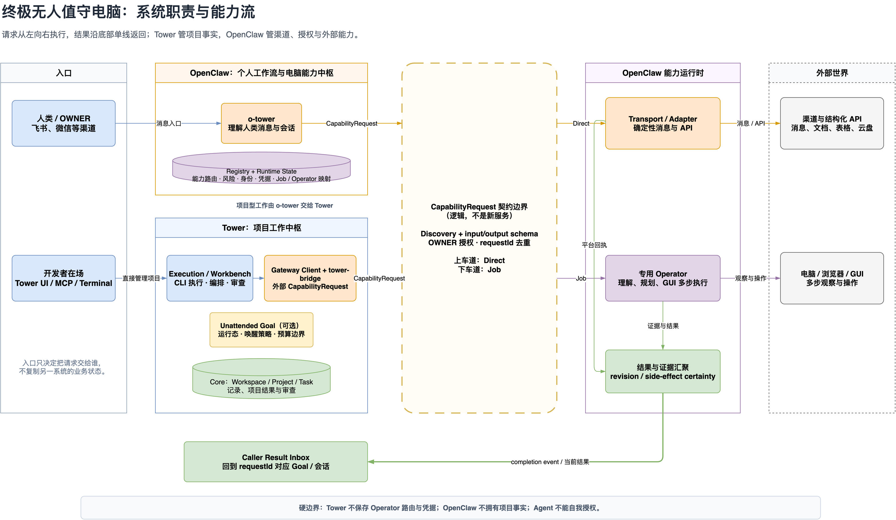
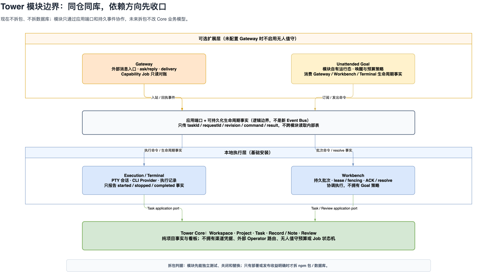
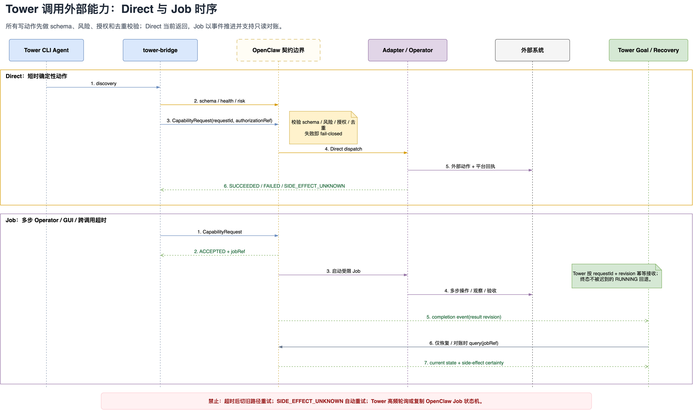
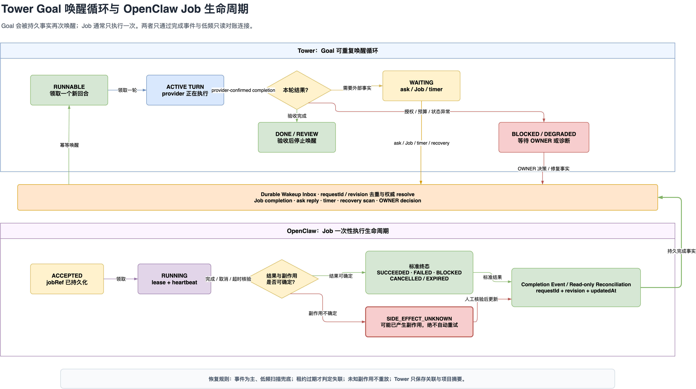

# 终极无人值守电脑架构图解

> 状态：定稿；已同步首个模块化与恢复增量
> 日期：2026-08-01
> 上位章程：[`ultimate-unattended-computer-charter.md`](./ultimate-unattended-computer-charter.md)
> 可编辑图源：[`ultimate-unattended-computer.drawio`](./diagrams/ultimate-unattended-computer/ultimate-unattended-computer.drawio)

本文把章程中的系统边界转成四张图，回答四个不同问题：

1. 系统由谁负责什么，数据归谁；
2. Tower 调用外部能力时，Direct 与 Job 分别怎么走；
3. 终端、进程或回调中断后，Goal 与外部 Job 如何恢复。
4. Tower Core、Execution、Workbench、Gateway 与 Unattended Goal 如何在同仓同库中保持模块边界。

图中的 `Capability Port`、`Durable Wakeup Inbox`、`结果与证据汇聚` 都是**逻辑职责**，不是已经决定
要新建的服务、进程或数据库。Technical Spec 必须优先把这些职责映射到 OpenClaw 和 Tower 的现有能力。

## 1. 总体架构



### 1.1 从左向右阅读

第一列是两个入口：

- 人类通过飞书、微信等渠道进入 OpenClaw，由 o-tower 理解消息与会话；
- 开发者在电脑前可以直接进入 Tower，不需要绕行 OpenClaw。

第二列是两个中枢：

- **OpenClaw** 拥有 OWNER 身份、渠道、外部 Job、凭据和本机 Operator 路由；
- **Tower** 拥有 Workspace、Project、Task、Goal、项目产物和审查结果。

中间虚线区域是结构化能力契约边界。o-tower 和 Tower 都可以提交同一种 `CapabilityRequest`，但
请求不携带具体 Agent、workspace 路径或底层命令。边界负责 discovery/schema、授权、去重、车道选择、
结果归一化和恢复对账；这些职责可以由多个现有工具共同承担。

右侧执行层分为两类：

- **Transport / Adapter**：发送已经生成好的消息，或执行参数明确的结构化 API；
- **Operator**：处理确实需要理解、规划、观察和 GUI 操作的多步工作。

两类执行结果先汇聚成统一结果与证据，再回到原主责任方：项目结果回 Tower 推进和审查，渠道请求结果
回 OpenClaw 的正确会话。外部能力调用不会改变项目事实所有者。

### 1.2 三条硬边界

1. Tower 不保存 `computer.gui -> operator`、`feishu.* -> xiao-fei` 等本机路由和凭据。
2. OpenClaw 不复制 Tower 的项目、任务、Goal 和知识作为第二套业务真相。
3. Agent 不能通过填写布尔字段、调用 `set_goal_mode` 或改写目标来自我授权。

### 1.3 Tower 内部模块边界



当前不拆 npm 包、不拆进程、不拆数据库。边界先落实为代码目录、模块自有运行态、MCP capability group、
应用端口和生命周期事实：

- **Core** 只拥有 Workspace、Project、Task、记录/笔记与审查等项目事实；
- **Execution / Terminal** 拥有 PTY、Provider 和执行记录，只报告执行生命周期；
- **Workbench** 拥有批次、lease、fencing、ACK 与 resolve，协调执行但不拥有 Goal 策略；
- **Gateway** 拥有外部消息、投递、ask/reply 与外部 Job 对账适配；
- **Unattended Goal** 是依赖 Gateway 的可选组合模块，拥有自己的运行态和后续唤醒/预算策略。

同库不等于跨模块随意读表。新增代码应通过模块入口传 command/event/result，只把 Core ID 当引用。等到
独立部署、独立发布或数据保留策略带来明确收益时再拆包；届时不应修改 Core 项目模型。

## 2. Direct 与 Job 调用时序



### 2.1 Direct 车道

Direct 用于短时、确定性、边界清晰的动作，例如向固定 OWNER 渠道发送一条已生成消息，或调用一个
参数明确的外部 API。

调用顺序是：

1. Tower 先 discovery，取得 capability 状态和固定版本 schema；
2. Tower 预检请求，OpenClaw 在可信边界再次做权威 schema、风险、授权和去重校验；
3. Adapter 执行动作并取得平台回执；
4. 当前调用返回最终结果。

Direct 不创建通用 Job。可能已经发生副作用却拿不到可信回执时，结果是 `SIDE_EFFECT_UNKNOWN`，不能
把超时当成失败后自动重发。

### 2.2 Job 车道

Job 用于多步 Operator、GUI 操作或可能超过一次调用等待时间的工作。

1. OpenClaw 接收请求后先返回 `ACCEPTED + jobRef`；
2. Operator 持有执行 lease，完成观察、操作与验收；
3. OpenClaw 通过完成事件推送带 revision 的结果；
4. Tower 按 `requestId + revision` 幂等接收，已到终态的结果不被迟到的 `RUNNING` 回调覆盖；
5. 只有重启恢复、回调丢失或人工诊断时，Tower 才按 `jobRef` 做只读状态查询。

Tower 保存 `requestId/jobRef` 关联和项目需要的摘要，不复制 OpenClaw 的完整 Job 状态机，也不高频轮询。

## 3. Goal 唤醒循环与 Job 生命周期



### 3.1 Tower Goal 唤醒循环

Tower Goal 只有在存在持久唤醒事实时进入 `RUNNABLE`。执行一轮时进入 `ACTIVE TURN`，provider 确认
回合结束并持久化等待条件后，才进入 `WAITING`。

可唤醒 Goal 的事实包括：

- 人类回复 OPEN ask；
- 外部 Job 完成、阻塞或副作用不确定；
- 持久定时点到期；
- Tower 重启恢复扫描。

这些事实先进入逻辑上的 Durable Wakeup Inbox，完成事件去重和权威 resolve，再把 Goal 变为
`RUNNABLE`。终端沉默不是唤醒、失败或安全注入条件。

授权缺失、预算耗尽或状态无法判断时进入 `BLOCKED / DEGRADED`；只有 OWNER 决策或诊断修复形成新事实
后才继续。完成必须经过主责任方验收，随后保存结果并停止继续唤醒。

### 3.2 OpenClaw Job 生命周期

外部 Job 的权威状态归 OpenClaw：

- `ACCEPTED` 后持久化 `jobRef`；
- `RUNNING` 期间续 lease 或写 heartbeat；
- 结束时根据可观察结果与副作用确定性进入标准终态；
- 可能已发生副作用但无法确认时进入 `SIDE_EFFECT_UNKNOWN`，绝不自动重试。

完成事件和只读对账结果回到 Tower 的持久唤醒入口。事件是主路径，低频恢复扫描只是安全网。

## 4. Tower 与 OpenClaw 改造清单

下面是架构责任清单，不是已经批准的文件级实施方案。新增表、API 或进程前仍要在 Technical Spec 中
验证现有能力；实现顺序固定为“复用原生能力、增加薄适配、最后才新增组件”。

### 4.1 Tower 需要改什么

| 优先级 | 改造项 | 复用基础 | 完成标准 |
|---|---|---|---|
| 已完成 | 把 `tower-bridge` 从具体 Agent / 命令路由收敛为结构化 `CapabilityRequest` 边界 | Tower sibling task 留在 Tower；真人消息留在 `tower-ask` | 外部能力请求不再写 `xiao-fei`、本机 workspace 或裸委托命令 |
| 已完成 | 修正 goal mode 授权语义 | `set_goal_mode` 只保存可选模块运行态 | prompt 不再把激活视为授权；返回值明确 `authorizationGranted: false` |
| 已完成 | 把 unattended 运行态移出 Core Task 所有权 | 新增 `UnattendedGoalRuntime`；旧字段保留一轮兼容 | 所有新读写经 goal 模块；生命周期生产者只报告事实 |
| 已完成 | 复用 OpenClaw 原生 Task 状态做 Job 恢复查询 | `openclaw tasks show <ref> --json` | `get_capability_job_status` 只读归一化结果，未知/失联保守映射 |
| P0 | 接入 discovery 与 schema 预检 | MCP/Skill 现有结构化工具面 | Tower 可缓存固定版本 schema；版本不兼容或能力不可用时提交前失败 |
| P0 | 跑通 OWNER home-route Direct 消息闭环 | `push_to_human`、outbound 去重、`SENT_UNVERIFIED`、ask/park | grant、目标强制和 `requestId` 去重同时落地，不重复发送 |
| P1 | 保存外部请求关联与项目摘要 | Tower 已有 Task/Goal、消息和证据归属 | 只保存 `requestId/jobRef`、当前 revision、结果摘要和证据引用，不镜像 Job 状态机 |
| P1 | 把外部完成事实接入 Workbench 唤醒边界 | `WorkbenchBatch`、ACK/resolve、lease/fencing、command inbox | 重复/乱序回调幂等；只在安全回合边界让 Goal 重新 `RUNNABLE` |
| P1 | 增加低频恢复对账与诊断入口 | 现有恢复、maintenance 与 harness diagnostics | 重启或回调丢失时按 `jobRef` 只读查询，不高频轮询 |
| P1 | 补结果审查和异常呈现 | 现有 Task review、Harness/Workbench UI | 清楚展示 `BLOCKED`、证据和 `SIDE_EFFECT_UNKNOWN`，未知副作用不提供自动重试 |

本轮没有实现 discovery 服务、通用授权签发器、跨系统完成事件或确定性的 Operator Job 提交入口。
它们仍是后续纵向闭环，不得因为已有契约文案和状态查询工具而宣称完整无人值守已经完成。

Tower **不应该**新增第二套外部能力目录、保存 OpenClaw 凭据、复制 Operator 运行日志，或再造一个独立
定时调度系统。Goal 唤醒应接入现有 Workbench 持久事件与恢复机制。

### 4.2 OpenClaw 需要改什么

| 优先级 | 改造项 | 实现约束 | 完成标准 |
|---|---|---|---|
| P0 | 盘点并暴露 capability discovery | 优先组合现有 tool/task/run/status 元数据 | 返回能力版本、READ/ACT、schema/schemaRef、风险和健康状态 |
| P0 | 建立单一 Registry 权威 | 可以是现有配置和工具元数据的逻辑汇总，不默认新建服务或数据库 | o-tower 与 Tower 调用得到相同路由、风险和可用性判断 |
| P0 | 在可信边界做权威校验 | 调用方预检不构成信任 | 校验 schema、来源、风险、grant、目标和 `requestId` 去重后才执行 |
| P0 | 实现 OWNER home-route 强制 | Agent 不得传入或覆盖真实目标 | unattended grant 仅允许发送到已验证 OWNER 本人渠道 |
| P0 | Direct 车道复用确定性 Adapter | 简单发送/结构化 API 不启动 o-tower 或 Operator | 当前调用返回标准结果；超时且副作用未知时不切旧路径重发 |
| P1 | 用一个真实 Operator 跑通 Job 车道 | 先验证现有 session/task/run 是否足够 | 返回 `ACCEPTED + jobRef`，持有 lease/heartbeat，完成后产生标准结果 |
| P1 | 提供完成事件和只读状态查询 | 回调为主、查询为恢复安全网 | 查询包含状态、revision、`updatedAt`、副作用事实与确定性 |
| P1 | 统一结果、证据和副作用语义 | 不要求迁移已有稳定枚举 | 输出验收事实、动作、证据引用、blocker；未知副作用映射为 `SIDE_EFFECT_UNKNOWN` |
| P1 | 按 capability 单路迁移 o-tower 旧 prompt | 影子阶段只比较决策，不能双执行 | 每个 `requestId` 只走新旧其中一条路径，真实 E2E 通过后才删旧映射 |

OpenClaw **不应该**拥有 Workspace/Project/Task/Goal，不负责项目拆解或 Goal 调度，也不应让 o-tower 再读
一遍 Tower 的完整项目上下文。它只接收完成外部动作所需的最小结构化材料。

### 4.3 OpenClaw 原生能力核验（2026-08-01）

本机 OpenClaw `2026.7.1-2` 已核验：

- `openclaw message send --json` 可作为确定性消息 Adapter 基础；
- `openclaw agent ... --json` 会产生可持久化的 run/task；
- `openclaw tasks show <taskId|runId> --json` 可返回权威状态与时间戳；
- 一次无副作用探针成功生成 run，并能通过 `tasks show` 对账为 `succeeded`。

因此首版恢复查询采用薄适配，不在 Tower 新建外部 Job 表或第二套状态机。尚未确认的部分是稳定的非 LLM
Job 提交/回调入口、完整 discovery schema 与可信授权签发；确认前继续 fail-closed。

### 4.4 双方共同定义但不共享数据库

双方只共同维护版本化契约：

- `CapabilityRequest` envelope 与 per-capability input/output schema；
- discovery 响应、Direct 结果和 `ACCEPTED + jobRef`；
- completion event 与只读 status/reconciliation 响应；
- `requestId + revision + updatedAt` 的去重、乱序覆盖和终态规则；
- `authorizationRef` 的签发者、限域字段、过期和防重放规则；
- 标准结果状态、证据引用和 side-effect certainty。

首版不建跨系统共享表，也不允许双方直接写对方数据库。Tower 保存项目关联和摘要；OpenClaw 保存
外部执行、租约、凭据与副作用事实。

## 5. 建议的首个纵向闭环

第一阶段只跑通一个端到端用例：

```text
Tower task
  -> discovery human.message.send
  -> 校验一次性 OWNER 授权或限域 unattended grant
  -> 强制固定 OWNER home route
  -> Direct 发送并取得平台回执
  -> Tower 记录结果；需要回复时 park
  -> OWNER 回复后幂等 resolve 并唤醒 Goal
```

该闭环必须同时交付授权和目标强制护栏，不能先做“能发送”再把安全留到后续。它跑通以后，再接一个
真实 Operator Job；通用 R2/R3 授权、更多 capability 和 GUI E2E 都在后续逐步扩展。

## 6. 定稿检查清单

定稿前只需要确认四件事：

1. Tower 与 OpenClaw 的职责和数据归属是否符合实际目标；
2. Capability Port 作为虚线逻辑边界是否足够清楚，没有被误读成新服务；
3. Direct、Job、回调和恢复查询的关系是否符合预期；
4. 首个纵向闭环是否足够小，同时没有推迟必要授权护栏。

文件级实现、迁移窗口、验证命令和下一阶段门禁见
[`ultimate-unattended-computer-technical-spec.md`](./ultimate-unattended-computer-technical-spec.md)。
