# Workbench Durable Runtime

> Status: the durable inbox, explicit batch-ACK layer, atomic gateway completion
> outbox and persisted runtime projection are implemented on
> `feat/workbench-gateway-0.3.1`.
>
> This document explains the runtime control plane that keeps a resident
> Workbench progressing after server reloads, lost in-memory signals, and busy
> agent turns.
>
> For the current end-to-end architecture, state machine, rollout status and
> Chinese operator guide, read
> [`workbench-reliable-gateway-architecture.md`](workbench-reliable-gateway-architecture.md).

## 1. The problem in one sentence

Persisting an event is not enough: some durable process must repeatedly discover
that event and move it forward.

The original implementation persisted `WorkbenchEvent`, but the fast-path
delivery trigger was a process-local boundary token plus a timer:

```text
enqueue -> SQLite PENDING -> in-memory timer -> PTY write -> CONSUMED
```

If the timer disappeared during a restart, or the event arrived while the
Workbench was busy, the database correctly retained `PENDING` while nothing was
responsible for looking at it again.

## 2. P0 architecture

```mermaid
flowchart LR
  Producer["Gateway / child completion"] --> Event["WorkbenchEvent\nPENDING"]
  Event --> Scanner["Durable reconciler\n2 second scan"]
  Scanner --> Runtime{"Parent Workbench"}
  Runtime -->|not running| Resume["Continue or start PTY"]
  Runtime -->|running + idle| Boundary["Restore safe boundary"]
  Runtime -->|running + busy| Wait["Keep PENDING\nretry next scan"]
  Resume --> Boundary
  Boundary --> Drain["Claim + batch + PTY submit"]
  Drain --> Dispatched["WorkbenchBatch\nDISPATCHED"]
  Dispatched --> Ack["Agent explicit ACK\nprocessing lease accepted"]
  Ack --> Heartbeat["Heartbeat every 2 minutes\nwhile unresolved"]
  Heartbeat --> Resolved["Resolve transaction\nWorkbenchBatch RESOLVED"]
  Resolved --> Consumed["WorkbenchEvent CONSUMED"]

  Gateway["GatewayInbound\nQUEUED / PROCESSING"] --> Watchdog["Gateway watchdog\n10 second scan"]
  Watchdog --> Link["Recover task link / confirmation"]
  Watchdog --> Delivery["Retry GatewayDelivery"]
  Link --> Scanner
```



The important inversion is:

```text
Before: boundary/timer drives consumption; SQLite records the result.
Now:    SQLite drives eventual consumption; boundary only proves delivery is safe.
```

The enqueue timer remains because it reduces normal-path latency. It is no
longer the only trigger.

## 3. Runtime invariants

### 3.1 A busy Workbench must never receive injected input

`PtySession.isAtTurnBoundary` is set only by a provider stop/turn-complete
callback. The reconciler restores a boundary only when this flag is true.
Output-idle time is not used as evidence of completion.

### 3.2 A pending event must survive every skipped attempt

When the parent is busy, the reconciler does not claim or mutate the event.
It remains `PENDING` with `attempts = 0`, ready for the next scan.

### 3.3 Only delivery attempts increment `attempts`

An event moves to `PROCESSING` and increments `attempts` only inside the
transactional claim performed by the drain. A scan that merely observes a busy
parent is not a delivery attempt.

### 3.4 One database has one runtime leader

The Next.js instrumentation module still uses process-local single-flight
guards, while `TowerRuntimeLease` fences scanner ownership across processes.
Only the database lease holder may run the Workbench, Gateway, and Harness
outbox recovery loops.

### 3.5 Recovery is idempotent

- Workbench events use stable `dedupKey` values.
- Gateway task confirmation uses a durable `GatewayTaskLink`.
- Gateway deliveries use stable delivery deduplication keys.
- Overlapping interval ticks are rejected by a single-flight running flag.

## 4. Recovery scenarios

| Scenario | P0 behavior |
|---|---|
| Event arrives while Workbench is idle | Enqueue timer delivers quickly; scanner is fallback |
| Event arrives while Workbench is busy | Event stays `PENDING`; scanner retries after the next completed turn |
| Tower server restarts | Scanner rediscovers every pending parent from SQLite |
| Workbench PTY is missing | Scanner continues or starts the Workbench and opens its initial safe boundary |
| PTY survives but memory boundary is lost | Scanner restores the boundary only if the provider marked the turn complete |
| Task was created before confirmation crashed | Gateway watchdog verifies the durable link and task, confirms it, and wakes the Workbench |
| A linked child task was deleted | Foreign-key cascade removes the link; recovery never accepts an orphan as task evidence |
| Outbound delivery temporarily fails | Gateway watchdog invokes the existing durable delivery retry |
| Reviewed task becomes `DONE` while Tower exits | The same transaction already contains a `FINAL_RESULT/PENDING` outbox row |
| Workbench is busy or unhealthy | `WorkbenchRuntime` records generation, heartbeat, batch, pending count and blocking reason for Missions |

## 5. Code map

| Responsibility | Location |
|---|---|
| Event enqueue, claim, batch and reconciliation | `src/lib/workbench/coordinator.ts` |
| Process-local safe-boundary optimization | `src/lib/workbench/boundary.ts` |
| Provider-confirmed PTY turn state | `src/lib/pty/pty-session.ts` |
| Gateway workflow recovery | `src/lib/harness/gateway-router.ts` |
| Background control-loop startup | `src/instrumentation.ts` |
| Coordinator tests | `src/lib/workbench/__tests__/coordinator.test.ts` |
| Gateway recovery tests | `src/lib/harness/__tests__/gateway-router.test.ts` |
| Runtime health projection in Missions | `src/actions/agent-actions.ts`, `src/components/missions/mission-card.tsx` |
| Runtime schema and migration | `prisma/schema.prisma`, `scripts/migrations/0022-workbench-runtime.ts` |

## 6. Reliability layers after P0

The first P1 slice is now implemented:

1. `WorkbenchBatch` persists `CLAIMED -> DISPATCHED -> ACKED -> RESOLVED`.
2. PTY delivery no longer consumes inbox rows.
3. The bound Workbench calls `ack_workbench_batch` after reading a batch,
   heartbeats every two minutes while it remains responsible, and calls
   `resolve_workbench_batch` after handling or durably delegating every item.
4. `CLAIMED`, `DISPATCHED`, and `ACKED` are leased. An expired lease replays the
   same batch ID with a new generation and fencing token.

The remaining layers are now implemented:

1. `WorkbenchRuntime` persists execution generation, heartbeat, health,
   active batch, pending count, oldest pending time and blocking/error details.
2. `complete_gateway_work` accepts an reviewed `IN_REVIEW` task and uses one
   transaction to move it to `DONE` and create the idempotent
   `FINAL_RESULT/PENDING` outbox row. A transport failure changes only the
   delivery state; it cannot erase the outbox.
3. Missions shows a Workbench health badge (`G<generation>`, state and pending
   count). Its tooltip exposes the current batch, heartbeat and blocking reason.

The current implementation deliberately remains *at-least-once* at the external
transport boundary. A platform receipt that proves a message was sent but not
that it was threaded correctly is retained as `SENT_UNVERIFIED` for manual
review instead of being retried into a duplicate.

## 7. How to verify manually

1. Send a project-work request from a Feishu group and confirm the queued and
   task-created replies are threaded to the source message.
2. Let the child finish and verify its `CHILD_REVIEW_REQUIRED` event is consumed
   and the Workbench receives the review prompt.
3. Repeat while the Workbench is answering another turn. The event must remain
   pending until that turn completes, then be delivered automatically.
4. Stop Tower after the child event is persisted but before it is delivered.
   Restart Tower. The event must be rediscovered without sending another Feishu
   message.
5. Verify the reviewed final result is sent once and the inbound becomes
   `PROCESSED`.
6. In Missions, hover the Workbench health badge and verify generation,
   heartbeat, pending count, active batch and blocking reason.
