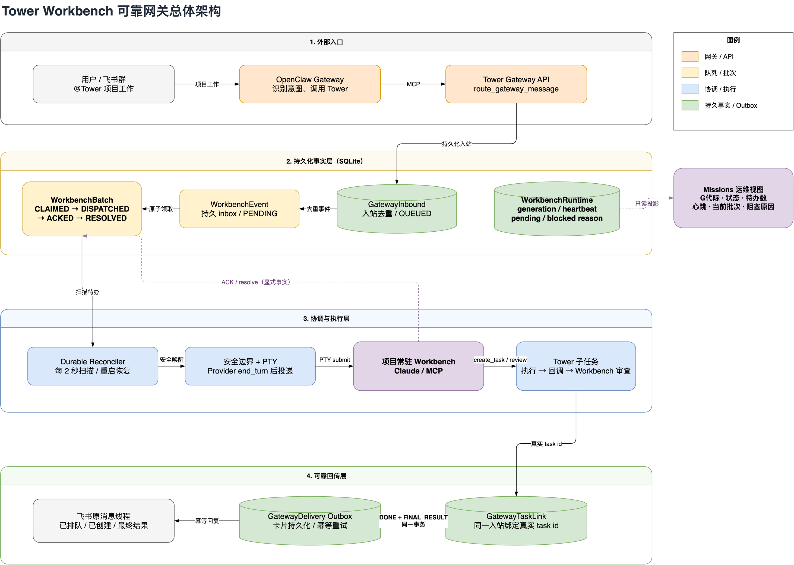
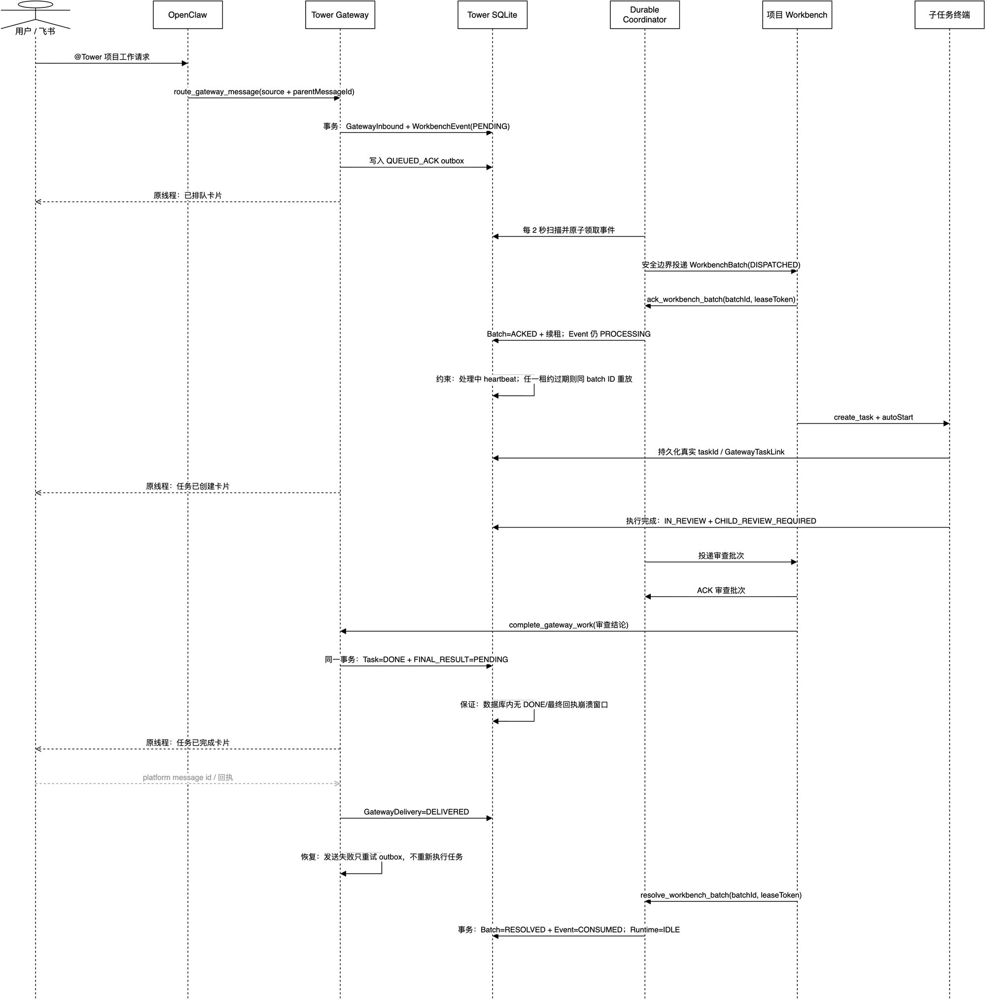

# Workbench 可靠网关架构

> 本文是 Tower 当前 Workbench / 飞书网关链路的主说明文档。
> 它既记录已经落地的设计，也明确还没有完成的可靠性工作，避免把“计划”误当成“现状”。
>
> 本轮验收证据见
> [`workbench-final-architecture-verification-2026-07-28.md`](workbench-final-architecture-verification-2026-07-28.md)；
> 批次 ACK 的首轮记录见
> [`workbench-batch-ack-verification-2026-07-28.md`](workbench-batch-ack-verification-2026-07-28.md)。

## 1. 先理解这条链路

飞书里的项目工作不会直接由 OpenClaw 实现。它先进入 Tower 的持久化队列，再由项目常驻
Workbench 创建子任务、等待执行、审查结果，最后通过可靠 outbox 回复原飞书消息。



对应的可编辑源文件：
[`docs/diagrams/workbench-reliable-architecture.drawio`](../diagrams/workbench-reliable-architecture.drawio)。

| 组件 | 负责 | 不负责 |
|---|---|---|
| 飞书 / OpenClaw | 收消息、识别意图、调用 Tower 网关 | 直接修改项目、伪造任务结果 |
| `GatewayInbound` | 入站去重、记录原消息和处理状态 | 驱动终端 |
| `WorkbenchEvent` | Workbench 的持久化 inbox | 证明 Agent 已经读到消息 |
| `WorkbenchBatch` | 记录一批事件从领取到确认完成的生命周期 | 代替真实任务 |
| Durable Coordinator | 扫描、恢复、在安全边界投递、超时重试 | 判断项目结果是否正确 |
| 项目 Workbench | 调研、创建任务、审查和决定最终回复 | 飞书传输重试 |
| `GatewayDelivery` | 持久化待发卡片并幂等重试 | 生成未经审查的结论 |
| `WorkbenchRuntime` | 记录运行代际、心跳、当前批次、积压和阻塞原因 | 代替 inbox / batch 作为业务事实 |

## 2. 为什么上一版会“看起来收到，实际上没处理”

上一版把下面两件事当成了同一件事：

1. Tower 已把文本写进 PTY；
2. Claude Workbench 已读取并开始处理文本。

它们并不等价。长文本可能停留在输入框、回车可能没有真正提交，终端也可能在写入后立即退出。
如果 PTY 写入后立刻把 `WorkbenchEvent` 标成 `CONSUMED`，数据库就会产生一个假事实：
“消息已经消费”，但 Workbench 根本没有处理。

本轮改造新增了显式确认边界：

```text
PTY 写入成功       = DISPATCHED
Workbench 主动 ACK = ACKED，续租处理责任，事件仍是 PROCESSING
处理或稳定委派完成 = RESOLVED，同时事件才变为 CONSUMED
```

## 3. 批次状态机


对应的可编辑源文件：
[`docs/diagrams/workbench-batch-state-machine.drawio`](../diagrams/workbench-batch-state-machine.drawio)。

| 状态 | 含义 | 可观察事实 |
|---|---|---|
| `PENDING` | 事件已持久化，等待安全投递 | 重启不会丢 |
| `CLAIMED` | Coordinator 已原子领取并创建带租约的批次 | 其他扫描器不能重复领取；过期可恢复 |
| `DISPATCHED` | 文本已写入 PTY 并提交 | 还不能说 Agent 已收到 |
| `ACKED` | Workbench 携带 lease token 调用 `ack_workbench_batch` | 只确认已接手；事件仍是 `PROCESSING` |
| `RESOLVED` | Workbench 携带同一 token 调用 `resolve_workbench_batch` | 同事务把事件变为 `CONSUMED` |
| `FAILED` | 投递失败或任何处理中租约过期 | 事件返回 `PENDING`，同 batch ID 等待重放 |

批次 ID 由事件集合稳定计算。相同批次被重放时，Workbench 必须把它当成恢复，不是新请求。
任务链接、网关 delivery 和主要完成操作都有稳定去重键，因此恢复应继续原任务，而不是重复创建。

### 3.1 全链路时序图

下面的时序图把正常路径与三个关键可靠性边界放在同一条时间线上：

- ACK 前不把事件当成已消费；
- Workbench 审查后，`Task=DONE` 与 `FINAL_RESULT/PENDING` 同事务提交；
- 飞书发送失败只重试 outbox，不重新执行子任务。



对应的可编辑源文件：
[`docs/diagrams/workbench-gateway-sequence.drawio`](../diagrams/workbench-gateway-sequence.drawio)。

## 4. 当前完整工作逻辑

1. OpenClaw 入口只拥有路由、查询和诊断工具，调用 `route_gateway_message`；它没有
   `create_task`、终端或项目写工具。
2. Tower 创建或复用 `GatewayInbound`，并写入一个去重的 `GATEWAY_WORK_REQUEST`。
3. OpenClaw 收到 `project_work` 后结束当前回合；后续写操作只属于项目 Workbench。
4. 后台 reconciler 每 2 秒扫描 `PENDING`，确保重启后也有人继续推进。
5. 只有 Provider 已确认上一轮结束，Coordinator 才领取事件并向 Workbench PTY 投递。
6. 投递后批次是 `DISPATCHED`，事件仍是 `PROCESSING`；批次携带 generation、lease token
   与明确的过期时间。
7. Workbench 读到提示后立即用同一 lease token 调用 `ack_workbench_batch`；Tower 只把批次
   设为 `ACKED` 并续租，事件仍是 `PROCESSING`。长处理通过
   `heartbeat_workbench_batch` 续租。
8. Workbench 调研并调用 `create_task`。拿到真实 task id 后才调用
   `confirm_gateway_task_created`。
9. 子任务完成后再次通过 `WorkbenchEvent` 回到 Workbench；Workbench 审查通过才将任务置为
   `IN_REVIEW` 后由 Workbench 调用 `complete_gateway_work`；该调用在同一事务中写入
   `DONE` 与 `FINAL_RESULT/PENDING`，不再先单独调用 `move_task(DONE)`。
10. 每一张飞书卡片都先写入 `GatewayDelivery`，再幂等发送到原消息线程。
11. Workbench 完成当前批次中的所有事项或已稳定委派后，用同一 lease token 调用
    `resolve_workbench_batch`；批次与关联事件在同一事务变为 `RESOLVED + CONSUMED`。

## 5. 超时与重启时会发生什么

| 故障 | 恢复动作 |
|---|---|
| Tower 在事件入库后重启 | reconciler 从 SQLite 重新发现 `PENDING` |
| Workbench 正忙 | 不注入，事件保持 `PENDING` |
| PTY 写入失败 | 批次 `FAILED`，事件立即退回 `PENDING` |
| 创建 `CLAIMED` 后进程退出 | claim 租约过期，事件退回 `PENDING`，同一 batch ID 重放 |
| PTY 写入成功但无 ACK | dispatch 租约过期，事件退回 `PENDING` 并重放 |
| ACK 后、resolve 前退出 | processing 租约过期；普通事件与 gateway work 都能通用恢复 |
| 任务已创建、确认前崩溃 | `GatewayTaskLink` 恢复同一任务并补发确认 |
| 飞书发送失败 | `GatewayDelivery` 按去重键重试，不重新执行任务 |
| `DONE` 后发送前崩溃 | 同一事务已创建 `FINAL_RESULT/PENDING`，watchdog 继续发送 |
| Workbench 卡住或终端丢失 | `WorkbenchRuntime` 显示 `BLOCKED` / `DEGRADED` 与具体原因 |
| 无人值守外发前退出 | `HarnessOutbound=PENDING`，恢复 worker 继续发送 |
| 平台已收但本地回执不完整 | `SENT_UNVERIFIED`，激活 ask/park 但不重复发送 |
| 第二个 Tower 连接同一 DB | runtime leader lease 拒绝启动，避免双扫描器和双 PTY owner |

这里最重要的原则是：**数据库记录的是已证实的事实，而不是对终端行为的猜测。**

## 6. 已完成与后续阶段

| 阶段 | 内容 | 当前状态 |
|---|---|---|
| 1 | 持久 inbox、后台扫描、重启恢复、安全输入边界 | 已完成 |
| 2 | `WorkbenchBatch` 持久化批次生命周期 | 已完成 |
| 3 | 显式 `ack_workbench_batch` / `resolve_workbench_batch` 和 ACK 超时重放 | 已完成 |
| 4 | “任务置 DONE + FINAL_RESULT outbox”同事务提交 | 已完成 |
| 5 | Workbench heartbeat、generation、阻塞原因和 Missions 运维面板 | 已完成 |

五个阶段均已落地。外部平台传输仍采用正确的 **at-least-once + 幂等去重** 语义，而不是宣称
无法由飞书 API 证明的严格 exactly-once。若平台已经返回 message id、但无法证明引用线程或卡片
类型正确，delivery 会停在 `SENT_UNVERIFIED` 等待人工确认，不会自动重发制造重复消息。

## 7. 关键不变量

1. 没有 Provider turn-complete 证据，不向忙碌 PTY 注入。
2. PTY 写入成功不等于消费成功。
3. `WorkbenchEvent` 只有在同批次 `RESOLVED` 的事务中才能进入 `CONSUMED`。
4. `CLAIMED`、`DISPATCHED`、`ACKED` 都必须持有有界租约并可超时恢复。
5. ACK、heartbeat 和 resolve 必须同时校验 `parentTaskId` 与 lease token。
6. 所有 ACK、resolve、任务确认和 delivery 操作必须幂等。
7. 外部回复来自服务端持久化状态，不直接转发未经审查的终端输出。
8. `Task=DONE` 与 `FINAL_RESULT/PENDING` 必须同事务提交。
9. `WorkbenchRuntime` 只是运维投影；重放仍以 `WorkbenchEvent` / `WorkbenchBatch` 为准。
10. 外部消息入口不能直接创建任务或启动执行；所有写操作必须有绑定 Workbench 和持久
    `GatewayInbound`。
11. trusted channel 必须同时受 sender/chat 速率限制和 queued-work 硬上限保护。
12. 一个 SQLite 数据库同一时刻只能有一个 Tower runtime leader。
13. 无人值守外发必须先写持久 outbox 与 ask intent，再访问外部平台。
14. admission control 同时约束 chat、project、Workbench 与 global backlog。

## 8. 代码与数据位置

| 责任 | 文件 |
|---|---|
| 批次领取、投递、ACK、resolve、恢复 | `src/lib/workbench/coordinator.ts` |
| ACK / resolve 内部 API | `src/app/api/internal/workbench/batch/route.ts` |
| Agent MCP 工具 | `src/mcp/tools/harness-tools.ts` |
| 网关路由与 watchdog | `src/lib/harness/gateway-router.ts` |
| 后台 reconciler 启动 | `src/instrumentation.ts` |
| 数据模型 | `prisma/schema.prisma` |
| 迁移 | `scripts/migrations/0025-workbench-batch-leases.ts`、`0026-harness-outbox.ts`、`0027-runtime-leader-lease.ts` |
| Coordinator 测试 | `src/lib/workbench/__tests__/coordinator.test.ts` |
| Gateway 恢复测试 | `src/lib/harness/__tests__/gateway-router.test.ts` |

生产数据默认位于 `~/.tower/database/tower.db`。排查时最有价值的是同时查看
`GatewayInbound`、`WorkbenchEvent`、`WorkbenchBatch`、`WorkbenchRuntime`、`GatewayTaskLink` 和
`GatewayDelivery`、`HarnessOutbound` 与 `TowerRuntimeLease`，不要只看终端画面。

## 9. 验收清单

| 验收项 | 通过条件 |
|---|---|
| 普通讨论 | 回复原消息，不创建任务 |
| 项目工作排队 | 收到“已排队”卡片，尚不宣称已创建 |
| Workbench 投递 | 批次先 `DISPATCHED`，事件仍 `PROCESSING` |
| Workbench ACK | 批次 `ACKED`，事件仍为 `PROCESSING`，租约已续期 |
| 真实任务创建 | 有 `GatewayTaskLink`，飞书收到“任务已创建”卡片 |
| 子任务审查 | 未经 Workbench 接受不能发送最终结果 |
| 批次完成 | 批次最终为 `RESOLVED` |
| 最终回传 | `FINAL_RESULT` delivery 为 `DELIVERED`，回复原线程且只发一次 |
| 任一处理租约超时 | `CLAIMED/DISPATCHED/ACKED` 事件回 `PENDING`，批次变 `FAILED` |
| Workbench resolve | 批次 `RESOLVED`，事件在同一事务变 `CONSUMED` |
| Tower 重启 | 不重新发飞书请求也能继续原链路 |
| 原子完成 | 模拟飞书发送失败后，任务是 `DONE` 且 `FINAL_RESULT` 保持 `FAILED/PENDING` 可重试 |
| Outbound 崩溃恢复 | 发送前崩溃可重试；发送证据不完整进入 `SENT_UNVERIFIED` 且不重复发 |
| 双实例保护 | 第二个 runtime 无法取得同一数据库的 leader lease |
| Missions 健康态 | Workbench 卡片显示 generation、状态、积压；运行健康可见租约和 outbox |

## 10. 阅读顺序

建议先看本文的第 1～6 节，再看：

1. `docs/design/gateway-workbench-routing.md`：网关解析、讨论与任务路由细节；
2. `docs/design/workbench-durable-runtime.md`：后台扫描和安全边界实现；
3. `docs/modules/harness.md`：Harness / Gateway 模块入口；
4. 三个 `.drawio` 源文件：总体架构、批次状态机、全链路时序；后续架构变化要同步修改源文件，
   不要只改导出的 PNG。
