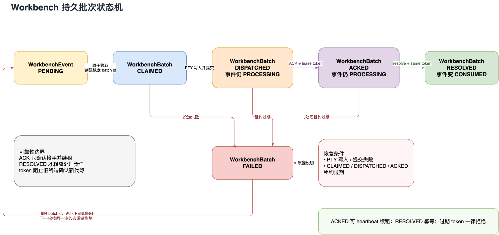
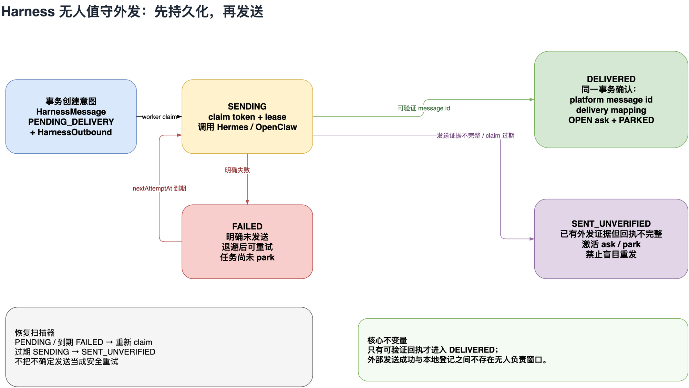

# Unattended Reliability Remediation (2026-07-29)

## Conclusion

The three primary crash windows identified by the external review were real.
This remediation makes processing responsibility and outbound intent durable,
leased database facts rather than adding another best-effort watchdog.

## Resolved findings

| Finding | Previous risk | Current guarantee |
|---|---|---|
| Crash after ACK | Events were already consumed and generic work could be lost | ACK only renews responsibility; resolve consumes atomically |
| Crash after CLAIMED | Batch and events could remain stuck forever | CLAIMED is leased and replays the same batch ID after expiry |
| Send before record | The human could receive a message without ask/park/mapping | `HarnessOutbound + HarnessMessage` persist before sending |
| Multiple runtimes | `globalThis` only protected one process | A database leader lease rejects a second Tower runtime |
| Per-chat quota only | Project or global backlog could still exhaust resources | Four-level chat/project/Workbench/global admission control |

## Lease and fencing

Each delivery carries a `generation`, random `leaseToken`, and
`leaseExpiresAt`. Workbench returns the token in ACK, heartbeat, and resolve.
A stale terminal cannot mutate a replayed or newer batch generation.

[Editable Draw.io source](../../diagrams/workbench-batch-state-machine.drawio)

## Unattended outbound

[Editable Draw.io source](../../diagrams/harness-outbox-state-machine.drawio)

- `PENDING`: the intent and ask are durable; the task is not parked yet.
- `DELIVERED`: platform receipt, delivery mapping, OPEN ask, and parking commit
  atomically.
- `FAILED`: the platform explicitly failed; retry follows backoff.
- `SENT_UNVERIFIED`: send evidence exists but the receipt is incomplete, so
  Tower does not blindly resend.

## Runtime boundary

`TowerRuntimeLease` codifies one Tower runtime per database. Even if two local
services are started accidentally, only the leader may run Workbench, Gateway,
and Outbox scanners. Runtime health reports the leader, leased batches, and
outbound backlog together.

## Added verification

- recovery after a crash in `CLAIMED`;
- recovery after an expired `ACKED` processing lease;
- stale lease tokens cannot ACK or resolve;
- an outbound failure does not park a task prematurely;
- stale `SENDING` is not blindly resent;
- caller dedup keys are idempotent;
- a second live runtime cannot acquire the same database.

